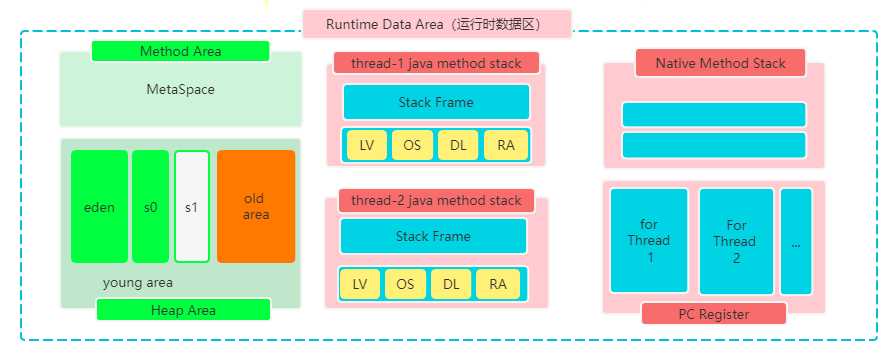

# JVM (JAVA虚拟机)

## 内容安排

* JVM体系结构
* JVM中的类加载子系统
* JVM中运行时内存区
* JVM中执行引擎(执行逻辑，GC逻辑)
* JVM中的字节码增强技术(拓展)

## JVM初识

* 为什么要学习JVM？
```
1. 为了面试 
2. 为了更好的理解JAVA
3. 为了更好的解决线上问题？(软件在线升级、防内存泄漏、提高吞吐量)
```
 
* 你了解哪些JVM产品？

```
1. Oracle公司的HotSpot。
2. IBM公司的J9
3. 阿里的TaobaoVM
4. .....
```

## JVM的体系结构

* JVM是什么？(一种虚拟机规范)
* JVM的构成有哪几部分？
```
1. 类加载子系统(负责将类读取到内存,校验类的合法性，对类进行初始化)
2. 运行时数据区(负责存储类信息，对象信息，以及执行计算的区域)
3. 执行引擎(负责从指定地址对应的内存中读取数据然后执行，同时还自带GC操作)
4. 本地库接口(负责Java语言与其它语言之间进行通讯)
```

* Hotspot虚拟机(JVM)的构成？


## JVM中类加载子系统

* 类加载子系统中有哪些常用类加载器吗？
```
1. BootStrapClassLoader(负责加载基础类库中的类,例如Object,String,....)
2. ExtClassLoader(负责加载扩展类库中的类ext/...)
3. AppClassLoader(负责加载classpath路径下我们自定义的类)
4. 自定义ClassLoader(可以指定自己要加载的路径或加载方式)
```


* 什么是双亲委派类加载模型？

```
双亲委派可以简单理解为依次向上询问类是否已经加载过，假如加载过则无需再次加载。
假如没有加载过则从顶层(BootStrapClassLoader)向下依次尝试是否可以加载此类，
假如可以则对类进行加载。
```


* 为什么要使用双亲委派加载模型？

```
通过这种机制可以更好保证一个类在内存中只被加载一次，例如java.lang.Object这个基础
类库中的类不需要反复加载。
```

* 双亲委派加载模型有什么弊端吗？

```
假如不同项目部署到了同一个web服务中，但是不同项目中有包名、类名相同的类(内容不同)，
这样可能会导致有一个类不会被加载。假如要想解决这个问题可以自己定义类加载规则，但是
无论你怎么定义，建议基础类库还是要使用双亲委派方式进行加载。
```


* 你能说说类加载的基本步骤吗？

```
1. 查找类(例如从指定路径找到包名+类名对应的文件)
2. 读取类(通过字节输入流对类进行读取)
3. 校验类(对内存中读取到的类信息进行校验、默认初始化等)
4. 创建字节码对象(java.lang.Class)
```


* 什么情况下会触发类的加载？

```
1. 直接通过类加载器(ClassLoader)的loadClass去加载。
2. 基于Class.forName("包名.类名")方式去加载。
3. 直接访问类的属性，方法，构建类的对象。
```

* 类加载时一定会执行静态代码吗？

```
不一定，静态代码块是否执行取决于类加载时是否执行了类的初始化。
```

* 如何理解类的主动加载和被动加载？

```
1. 主动加载：访问本类成员或方法时触发的类的加载。
2. 被动加载：访问本类对应的父类属性、方法时，本类属于被动加载，父类属于主动加载。
```

* 我们可以自己定义类加载器吗？

```
可以，当系统提供的类加载器不满足我们需求时，我们可以通过直接或间接的继承ClassLoader的方式，来定义
自己的类加载器。例如：

class SimpleClassLoader extends ClassLoader{
 ...
}
参考01-java项目中的com.jvm.SimpleClassLoader.
```
* 什么场景下需要自己定义类加载器？

```
1. 指定加载源头？(例如从数据库中读取类)
2. 保证类的安全？(例如可以在类编译时加密，加载时解密)
3. 打破双亲委派模型？(对自己写的类不想使用双亲委派机制了)
```

* 内存中一个类的字节码对象(Class)可以有多个吗?

```
可以，即使是同一个类，但是它的类加载器不同，生成的字节码对象也可以不同。
```

## JVM运行时内存区

* JVM 运行时内存区是如何划分的？

```
1. 方法区(Method Area): 存储类的字节码信息、常量池。
2. 堆区(Heap Area): 春初对象
3. Java方法栈(Stack Area): 所有方法运行时，会创建一个栈帧对象，然后进行入栈
4. 本地方法栈(Stack Area)：用C语言写的写方法执行时候，会进入本地方法栈
5. 程序计数器(Pc Register): 用于记录当前线程要执行的下一条字节码指令的地址
```




* 如何理解方法区(Method Area)？

```
方法区是逻辑上一种定义，是一种规范，不同JVM对方法区的落地实现可能不同，例如
在JDK7中方法区称之为持久代，在JDK8中方区叫元空间(Metaspace)，并且这个元空间
可以是JVM堆外的一块内存，不占用操作系统为JVM分配的内存。

```

* 如何理解JAVA中的堆(Heap)，它的构成是怎样的？

```
Java中的堆是用于存储对象的一块区域，可被所有线程所共享。这块区域又可以分为年轻代和老年代，
年轻代又分伊甸园区和2个幸存区(有一块区域始终是空的)。
```

* JVM虚拟机栈的结构是怎样？

Java中每个线程都有一个虚拟机栈(Java方法栈),每个方法的执行都会对应着一次入栈(Push)和出栈(Pop)操作，
栈中的元素为一个一个的栈帧(Stack Frame)对象，这个栈帧的构成主要有如下几部分:

```
1. 操作数栈(用于执行运算)
2. 局部变量表(用于存储方法内部的局部变量)
3. 方法的返回值(存储方法的返回值)
4. 动态链接(方法中要访问的一些常量池数据，要调用的方法，都会对应一个链接)
5. 其它信息
```

* 如何理解程序计数器？

```
程序计数器用于记录当前线程要执行的下一条指令的偏移量地址，每个线程都有一个程序计数器，
这个计数器也是所有内存中唯一一个不会出现内存溢出的区域。
```

* Java对象分配内存的一个基本过程是怎样？

```
1. 编译器通过逃逸分析(JDK8已默认开启)判定对象是在堆上分配还是在栈上分配。
2. 假如确定是在堆上分析，则可首先选择TLAB区，检测这块区域是否可以存储这个对象，可以则存储。
3. 假如TLAB区无法存储新创建的对象，则可以考虑在TLAB之外的Eden区加锁分配。
4. 如果Eden区无法存储对象，则执行Yong GC (Minor)-年轻代的垃圾回收
5. 假如Eden区执行Yong GC之后，仍然不足以存储对象，则直接分配老年代。
6. 假如老年代也不可以存储这个对象，则执行Full Gc，这个过后还不能存储则抛出异常。

```

16:10


