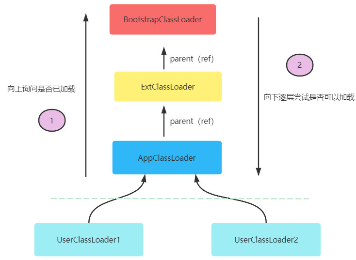

# JVM (JAVA虚拟机)

## 内容安排

* JVM体系结构
* JVM中的类加载子系统
* JVM中运行时内存区
* JVM中执行引擎(执行逻辑，GC逻辑)
* JVM中的字节码增强技术(拓展)

## JVM初识

* 为什么要学习JVM？

1. 为了面试 
2. 为了更好的理解JAVA
3. 为了更好的解决线上问题？(软件在线升级、防内存泄漏、提高吞吐量)
 
* 你了解哪些JVM产品？

1. Oracle公司的HotSpot。
2. IBM公司的J9
3. 阿里的TaobaoVM
4. .....

## JVM的体系结构

* JVM是什么？(一种虚拟机规范)
* JVM的构成有哪几部分？

1. 类加载子系统(负责将类读取到内存,校验类的合法性，对类进行初始化)
2. 运行时数据区(负责存储类信息，对象信息，以及执行计算的区域)
3. 执行引擎(负责从指定地址对应的内存中读取数据然后执行，同时还自带GC操作)
4. 本地库接口(负责Java语言与其它语言之间进行通讯)

* Hotspot虚拟机(JVM)的构成？

## JVM中类加载子系统

* 类加载子系统中有哪些常用类加载器吗？

1. BootStrapClassLoader(负责加载基础类库中的类,例如Object,String,....)
2. ExtClassLoader(负责加载扩展类库中的类ext/...)
3. AppClassLoader(负责加载classpath路径下我们自定义的类)
4. 自定义ClassLoader(可以指定自己要加载的路径或加载方式)

* 什么是双亲委派类加载模型？

双亲委派可以简单理解为依次向上询问类是否已经加载过，假如加载过则无需再次加载。
假如没有加载过则从顶层(BootStrapClassLoader)向下依次尝试是否可以加载此类，
假如可以则对类进行加载。

* 为什么要使用双亲委派加载模型？

通过这种机制可以更好保证一个类在内存中只被加载一次，例如java.lang.Object这个基础
类库中的类不需要反复加载。

* 双亲委派加载模型有什么弊端吗？

假如不同项目部署到了同一个web服务中，但是不同项目中有包名、类名相同的类(内容不同)，
这样可能会导致有一个类不会被加载。假如要想解决这个问题可以自己定义类加载规则，但是
无论你怎么定义，建议基础类库还是要使用双亲委派方式进行加载。

* 你能说说类加载的基本步骤吗？

1. 查找类(例如从指定路径找到包名+类名对应的文件)
2. 读取类(通过字节输入流对类进行读取)
3. 校验类(对内存中读取到的类信息进行校验、默认初始化等)
4. 创建字节码对象(java.lang.Class)

