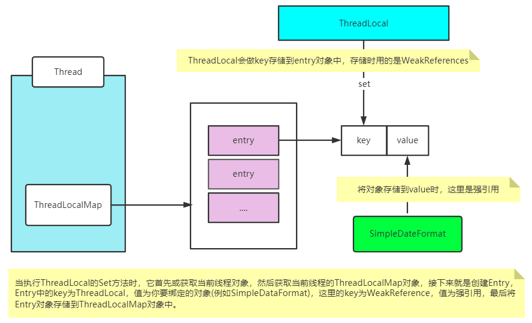

# ThreadLocal 应用分析

## ThreadLocal是什么？

线程本地变量，访问这个变量的每个线程都会有这个变量的一个本地拷贝。

## ThreadLocal可以解决什么问题？

1. 可以将某个对象存储到当前线程的ThreadLocalMap中
2. 可以从当前线程的ThreadLocalMap中获取到指定对象

通过这种机制，可以保证一个对象在当前线程只有一份，并且取消了线程间的共享，是线程安全的。

## ThreadLocal是如何应用的？

SimpleDateFormate是一个线程不安全的对象，假如基于此对象在一个工具类中实现将字符串
转换为Date对象，其设计过程如下：

```
private static AtomicLong atomicLong=new AtomicLong(1);
private static ThreadLocal<SimpleDateFormat> td=new ThreadLocal<>();
public static  Date parse2(String dateStr){
//获取当前线程中的SimpleDateFormat对象
SimpleDateFormat sdf=td.get();
if(sdf==null){
//当前线程没有SimpleDateFormat对象就创建对象
System.out.println("Create SimpleDateDateFormat ->"+atomicLong.getAndIncrement());
sdf=new SimpleDateFormat("yyyy/MM/dd HH:mm:ss");
//将创建的对象存储到当前线程
td.set(sdf);
}
Date date=null;
try {
date=sdf.parse(dateStr);
}catch (ParseException e){
e.printStackTrace();
}
return date;
}
```
## ThreadLocal的应用原理是怎样的？



## ThreadLocal可能会导致内存泄漏吗？

```
可能，因为线程中ThreadLocalMap内部对key的引用是弱引用(WeakReference)，这个
弱引用应用的key可能在GC时，就被移除了.但是value是强引用，key假如被GC了，那
value也就不能访问到了，但他还占用着内存，所以它会导致内存泄漏。
```


