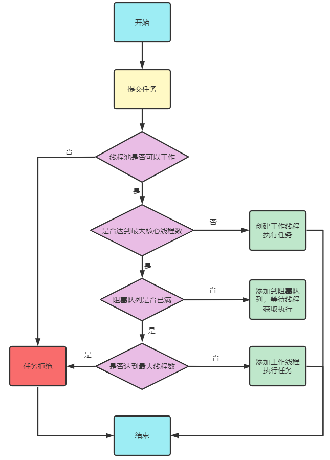

# ThreadLocal 应用分析

## ThreadLocal是什么？

线程本地变量，访问这个变量的每个线程都会有这个变量的一个本地拷贝。

## ThreadLocal可以解决什么问题？

1. 可以将某个对象存储到当前线程的ThreadLocalMap中
2. 可以从当前线程的ThreadLocalMap中获取到指定对象

通过这种机制，可以保证一个对象在当前线程只有一份，并且取消了线程间的共享，是线程安全的。

## ThreadLocal是如何应用的？

SimpleDateFormate是一个线程不安全的对象，假如基于此对象在一个工具类中实现将字符串
转换为Date对象，其设计过程如下：

```
private static AtomicLong atomicLong=new AtomicLong(1);
private static ThreadLocal<SimpleDateFormat> td=new ThreadLocal<>();
public static  Date parse2(String dateStr){
//获取当前线程中的SimpleDateFormat对象
SimpleDateFormat sdf=td.get();
if(sdf==null){
//当前线程没有SimpleDateFormat对象就创建对象
System.out.println("Create SimpleDateDateFormat ->"+atomicLong.getAndIncrement());
sdf=new SimpleDateFormat("yyyy/MM/dd HH:mm:ss");
//将创建的对象存储到当前线程
td.set(sdf);
}
Date date=null;
try {
date=sdf.parse(dateStr);
}catch (ParseException e){
e.printStackTrace();
}
return date;
}
```
## ThreadLocal的应用原理是怎样的？


## ThreadLocal可能会导致内存泄漏吗？

```
可能，因为线程中ThreadLocalMap内部对key的引用是弱引用(WeakReference)，这个
弱引用应用的key可能在GC时，就被移除了.但是value是强引用，key假如被GC了，那
value也就不能访问到了，但他还占用着内存，所以它会导致内存泄漏。
```

# 线程池应用

## 何为线程池？

线程池本质上就是一个存储了多个线程的容器，容器中的线程可以实现复用。
这种设计一种享元设计(享元模式)。

## 为什么使用线程池？

1. 线程对象的创建和销毁非常耗时
2. 复用线程，减少线程创建和销毁次数。

## Java中的池的创建？

1. 基于Executors类中的方法进行池的创建(不推荐)
2. 基于ThreadPoolExecutor创建(推荐)

## 进行池设计要考虑哪些参数？

1. 核心线程池数
2. 最大线程数
3. 阻塞式任务队列
4. 空闲线程的释放
5. 创建线的工厂
6. 任务拒绝策略

## 基于ThreadPoolExecutor创建线程池

```java

public class ThreadPoolExecutorTests {
    /**核心线程数*/
    static int corePoolSize=2;
    /**最大线程数*/
    static int maximumPoolSize=3;
    /**空闲线程释放时间*/
    static int keepAliveTime=60;
    /**阻塞式任务队列*/
    static BlockingQueue<Runnable> workQueue=new ArrayBlockingQueue<>(1);
    /**创建线程的工厂*/
    private static AtomicLong atomicLong=new AtomicLong(1);
    static ThreadFactory threadFactory=new ThreadFactory() {
        @Override
        public Thread newThread(Runnable r) {
            return new Thread(r, "tedu-2207-"+atomicLong.getAndIncrement());
        }
    };
    /**拒绝策略：
     * 1)AbortPolicy 直接拒绝，抛出异常
     * 2)DiscardPolicy 直接丢弃
     * 3)callerRunsPolicy 由调用着线程执行。
     * 4)DiscardOldestPolicy 丢弃队列中最早放入的任务，将当前任务交给线程池。
     * */
    static RejectedExecutionHandler handler=
            new ThreadPoolExecutor.CallerRunsPolicy();
    public static void main(String[] args) {
        ThreadPoolExecutor poolExecutor =
                new ThreadPoolExecutor(corePoolSize,
                        maximumPoolSize,
                        keepAliveTime,
                        TimeUnit.SECONDS,
                        workQueue,
                        threadFactory,
                        handler);
    }
}
```

## 基于池执行任务的逻辑是怎样的？



# 总结(Summary)


