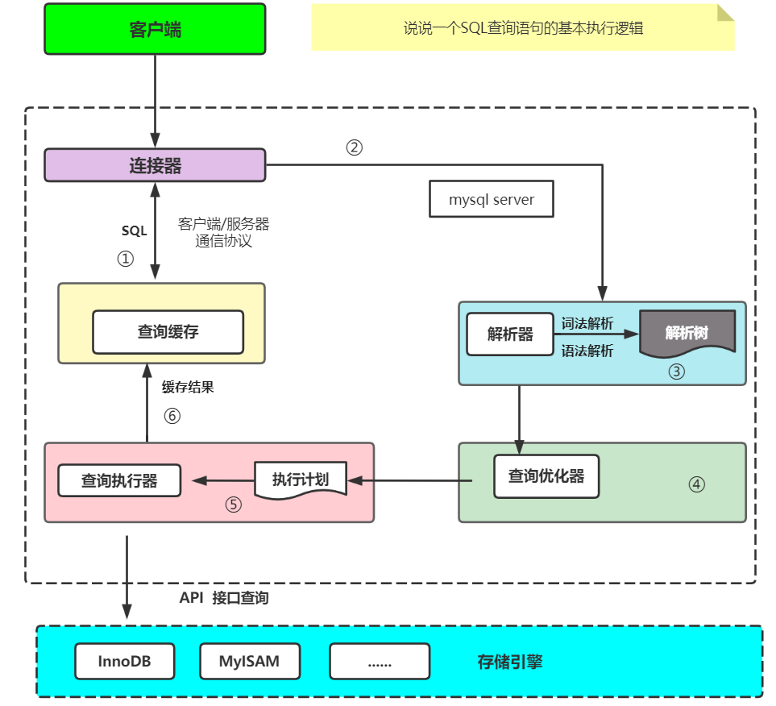
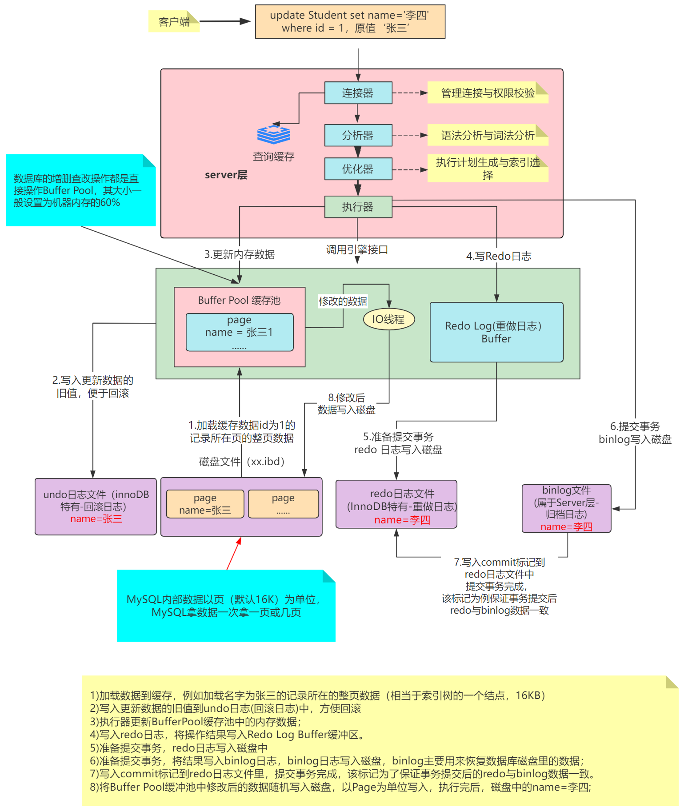

# 微人事(HR)系统数据库表设计及查询

## 课程安排

* 初始化
* 分析表设计
* 高级查询应用
* 视图(View)应用
* 事务(Transaction)应用

## 数据初始化操作

命令行登陆mysql，然后执行source d:/hr_mysql.sql

## 关键表设计分析

* 区域表(Regions)
* 国家表(Countries)
* 地址表(Locations)
* 部门表(Departments)
* 雇员表(Employees)
* 岗位表(Jobs)
* 岗位变更历史表(job_history)

## 表中关键字段分析

区域表(Regions)

```
CREATE TABLE regions
(
region_id int auto_increment comment '编号',
region_name VARCHAR(25) comment '区域名称',
primary key (region_id),
unique key (region_name)
) engine=innodb default character set utf8;
```

国家表(Countries)

```
CREATE TABLE countries
(
country_id CHAR(2) primary key,
country_name VARCHAR(40) comment '国家名称',
region_id int
)engine=innodb default character set utf8;

ALTER TABLE countries
ADD (
CONSTRAINT countr_reg_fk
FOREIGN KEY (region_id)
REFERENCES regions(region_id)
);
```

地址表(Locations)

```
CREATE TABLE locations
( location_id int(4) primary key auto_increment,
  street_address VARCHAR(40),
  postal_code VARCHAR(12), 
  city VARCHAR(30) not null, 
  state_province VARCHAR(25),
  country_id CHAR(2)
) engine=innodb default character set utf8;

ALTER TABLE locations
ADD (
CONSTRAINT loc_c_id_fk
FOREIGN KEY (country_id)
REFERENCES countries(country_id)
);

```
部门表(Departments)
```
CREATE TABLE departments
( department_id int(4) primary key auto_increment, 
  department_name VARCHAR(30) NOT NULL,
  manager_id int(6), 
  location_id int(4)
) engine=innodb default character set utf8;

ALTER TABLE departments
ADD (
CONSTRAINT dept_loc_fk
FOREIGN KEY (location_id)
REFERENCES locations (location_id)
) ;

```
岗位表(Jobs)
```
CREATE TABLE jobs
( job_id VARCHAR(10) primary key, 
  job_title VARCHAR(35) NOT NULL, 
  min_salary numeric(6), 
  max_salary numeric(6)
) engine=innodb default character set utf8;
```

雇员表
```
CREATE TABLE employees
( employee_id int(6) primary key auto_increment,
  first_name VARCHAR(20), 
  last_name VARCHAR(25) NOT NULL, 
  email VARCHAR(25) NOT NULL, 
  phone_number VARCHAR(20),
  hire_date DATE NOT NULL, 
  job_id VARCHAR(10) NOT NULL, 
  salary numeric(8,2), 
  commission_pct numeric(2,2),
  manager_id int(6), 
  department_id int(4), 
  CONSTRAINT emp_salary_min CHECK (salary > 0),
  CONSTRAINT emp_email_uk UNIQUE (email)
) engine=innodb default character set utf8;

ALTER TABLE employees
ADD (
CONSTRAINT emp_dept_fk
FOREIGN KEY (department_id)
REFERENCES departments(department_id)
,
CONSTRAINT emp_job_fk
FOREIGN KEY (job_id)
REFERENCES jobs (job_id)
,
CONSTRAINT emp_manager_fk
FOREIGN KEY (manager_id)
REFERENCES employees(employee_id)
) ;
ALTER TABLE departments
ADD (
CONSTRAINT dept_mgr_fk
FOREIGN KEY (manager_id)
REFERENCES employees (employee_id)
) ;

```
岗位历史变更表
```
CREATE TABLE job_history
( employee_id int(6) NOT NULL, 
  start_date DATE NOT NULL, 
  end_date DATE NOT NULL, 
  job_id VARCHAR(10) NOT NULL,
  department_id int(4), 
  CONSTRAINT jhist_date_interval
  CHECK (end_date > start_date), 
  CONSTRAINT jhist_emp_id_st_date_pk PRIMARY KEY (employee_id, start_date)
) engine=innodb default character set utf8;

ALTER TABLE job_history
ADD (
CONSTRAINT jhist_job_fk
FOREIGN KEY (job_id)
REFERENCES jobs(job_id)
,
CONSTRAINT jhist_emp_fk
FOREIGN KEY (employee_id)
REFERENCES employees(employee_id)
,
CONSTRAINT jhist_dept_fk
FOREIGN KEY (department_id)
REFERENCES departments(department_id)
) ;
```

## 常用查询分析及实践

**1)求雇员编号206的经理人的名字和薪水？**

请问雇员的经理人是雇员吗?是
那经理人的id是不是需要在雇员id中有相同值?需要

方案1：嵌套查询
```
select first_name,salary
from employees
where employee_id=(
   select manager_id
   from employees
   where employee_id=206
)
```
方案2：自关联(可以将自身这张表看成是多张表)
```
select m.first_name,m.salary
from employees e join employees m
on e.manager_id=m.employee_id
where e.employee_id=206
```
方案3：嵌套查询+表关联查询

```
select m.last_name,m.salary
from   (select manager_id
from employees
where employee_id = 206) e join  employees m
on e.manager_id=m.employee_id
```


**2)查询雇员206所在部门的部门名称以及这个部门所在的城市?**
-- 雇员表中有部门名称吗?没有,部门表(departments)中有
-- 雇员表中有城市名称名称?没有,地址表(locations)中有
```
select e.employee_id,d.department_name,l.city
from employees e join departments d on e.department_id = d.department_id
join locations l on d.location_id = l.location_id
where e.employee_id=206;
```

**3)统计每个岗位的雇员数,并按人数进行降序排序?**

```
select job_id,count(*) total
from employees
group by job_id
order by total desc;
```

**4)统计公司中有佣金提成的员工人数有多少?**

方案1
```
select count(*)
from employees
where commission_pct is not null;
```

方案2
```
select count(1)
from employees
where commission_pct is not null;
```

方案3(count函数内部是列名,表示统计列值不为null的记录)

```
select count(commission_pct)
from employees;
```

**5)统计年入职的人数有多少?(查看系统函数 help 'functions')**

```
select year(hire_date),count(*)
from employees
group by year(hire_date);
```

**6)查询每个部门的平均薪资,并按降序排序**

```
select department_id,avg(salary)
from employees
group by department_id
order by avg(salary) desc;
```


**7)查询每个部门的平均薪资,只显示平均薪资大于10000的,并按降序排序**

```
select department_id,avg(salary)
from employees
group by department_id
having avg(salary)>10000
order by 2 desc;
```

**8)查询每个雇员的薪资，并给出薪资等级(例如>=10000高;>=8000and<10000 中等;<8000偏低)**

考核知识点：case when 表达式的应用
```
select first_name,salary,
      (case when salary>=10000 then '偏高'
            when salary>=8000 then '中等'
            else '偏低' 
            end) level
from employees
```

**9)统计薪资大于等于10000的人数，小于10000的人数。**

```
select  sum(case when salary>=10000 then 1 else 0 end ) '大于等于10000',
        sum(case when salary<10000 then 1 else 0 end ) '小于10000'
from employees
```

```
select  count(case when salary>=10000 then 1 else null end ) '大于等于10000',
        count(case when salary<10000 then 1 else null end ) '小于10000'
from employees;
```


**10)查询雇员表中第二页的数据(每页最多显示10条记录-页面大小)？**

方案1:(数据量比较小的情况下-这种查询是全表扫描，数据量大时查询会比较慢)
```
select *
from employees
limit 10,10
```
方案2:(数据量比较大时-例如500万数据)

```
select e2.*
from (
         select employee_id
         from employees
         order by employee_id
         limit 10,10) e1 join employees e2
                         on e1.employee_id=e2.employee_id

```

**11)说说如下查询SQL语句的执行顺序**

```
select(7)
from (1)
join (3)
on (2)
where(4)
group by(5) 
having(6)
order by (8)
limit(9)
```

**12)说说如下查询返回的结果数是多少?**
雇员表有100条记录，部门表有10条记录
```
   select count(*)
   from employees,deparements;
```
返回的结果数为两张表数量的乘积.(这个查询为笛卡尔积)

**13)删区域表(Regions)中区域名字重复的记录**
准备工作(向表中写入一些重复的记录)
```
insert into regions(region_name) values ('Asia');
insert into regions(region_name) values ('Asia');
insert into regions(region_name) values ('Asia');
```
执行记录的删除?(不同数据库,不同版本中sql的编写可能会不同)

方案1:MariaDB可以,MySQL5.7不可以

```
delete
from regions
where region_id not in(
select min(region_id) 
from regions
group by region_name);
```

方案2:MariaDB可以,MySQL5.7可以
```
delete
from regions
where region_id not in(
select min_id
from (
select min(region_id) min_id
from regions
group by region_name)t);
```

方案3: 多表关联删除
```
delete r1.*
from regions as r1 join regions as r2
on r1.region_name=r2.region_name
and r1.region_id>r2.region_id;
```

## 视图(View)的应用

* 什么是视图?

数据库中的一个对象,可以将其看成是一张虚拟表,基于表创建,视图中只有结构,不存储数据,
可以通过视图查询到表中的数据.
  
* 为什么使用视图?
  
1. 简化程序对SQL语句的编写
2. 更好保证数据数据的安全

* 如何创建视图?

```
create view emp_view as
select e.employee_id,d.department_name,l.city
from employees e join departments d on e.department_id = d.department_id
join locations l on d.location_id = l.location_id;
```
* 如何基于视图查询数据

```
select employee_id,department_name,city from emp_view;
```

* 如何删除视图?

```
drop view if exists emp_view;
```
* 可以基于视图更新表中数据吗?

简单视图(基于单张表并且没有数据统计的视图)可以,但是不推荐.

## 数据库中的事务处理

* 什么是事务?

一个逻辑工作单元,这个工作单元中的所有操作,要么都成功要么都失败.
 
* 为什么要使用事务?

用于保证数据的正确性(完整,一致)

* 事务是如何保证数据的正确性的?

通过事务的四大特性(原子性,一致性,隔离性,持久性)

* 事务的隔离级别有哪些?

四种(read uncommitted,read committed,repeatable read,Serializable)

* 如何查询当前会话的事务隔离级别?
```
select @@tx_isolation;

```
* 如何修改当前会话的事务隔离级别?

```
 set session transaction isolation level read uncommitted;
 set session transaction isolation level read committed;
 set session transaction isolation level repeatable read;
 set session transaction isolation level serializable;
```
* 多个事务并发执行时可能会带来什么问题?

1. 脏读 (一个事务读取了其它事务为提交的数据)
2. 不可重复读(一个事务对同样查询条件的数据进行多次查询时,得到结果不一致)
3. 幻读 (一个事务读取到的数据可能是表中不存在数据)

* 如何解决多个事务并发执行时可能会带来什么问题?

修改事务的隔离级别,但要注意一点,隔离级别越高效率越差.

* 你知道事务的隔离级别在底层是如何实现的吗?

通过锁和MVCC(多版本并发控制)

## 作业(Homework)

* 一个SQL查询语句的执行流程是怎样的?
  


* 一个SQL更新语句的执行流程是怎样的?




  


