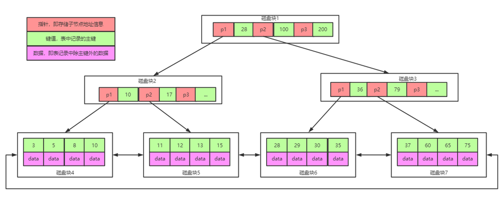
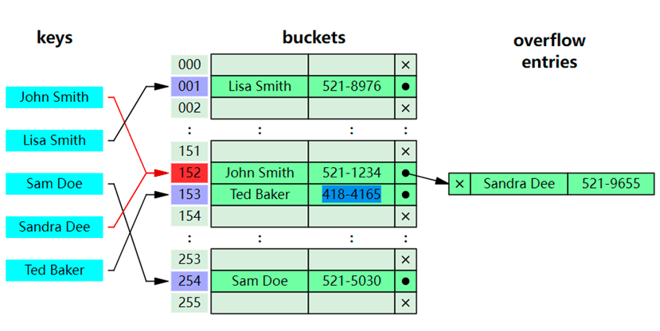
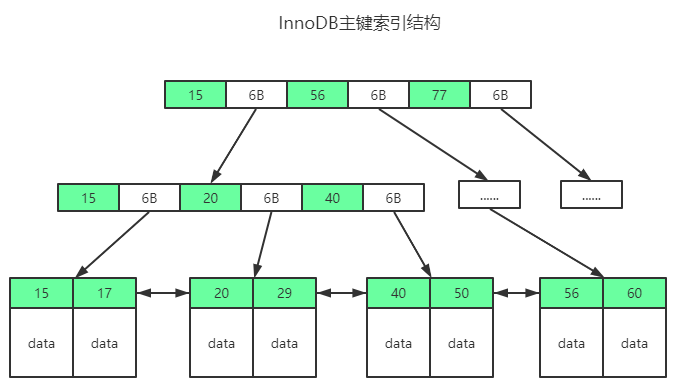
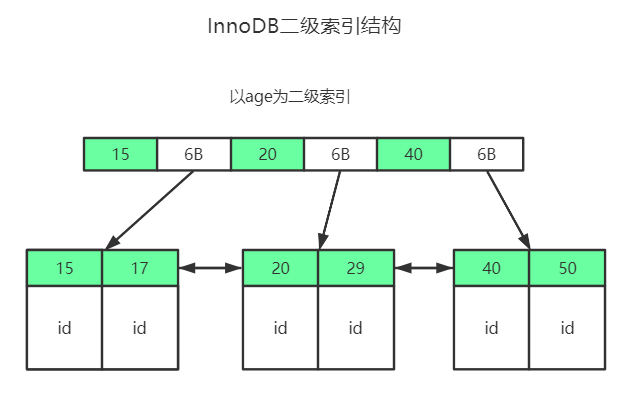
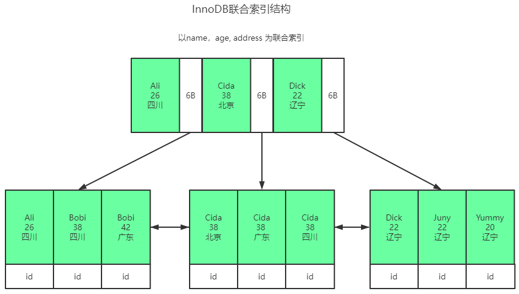
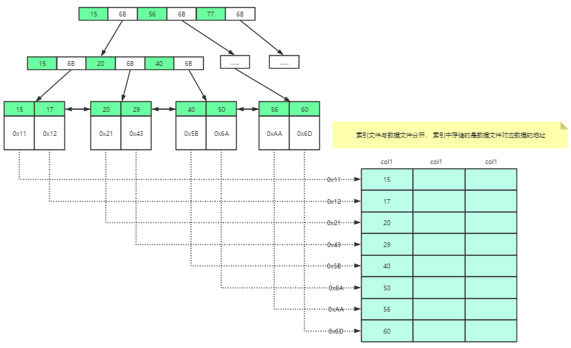

# MySQL中的索引应用

## 课程安排

* 索引的定义
* 索引的类型
* 索引的应用

## 索引的定义

* 什么是索引(Index)?

官方的定义索引是一种数据结构,从生活维度讲,假如将一本书看成是一张表,这本书的目录就是表中的索引.

* 为什么要使用索引(Index)

数据量比较大时,为了快速找到们需要的数据可以使用索引,这样可以提高查询的效率.

* 索引(Index)有什么弊端?

1. 会额外的占用空间
2. 对更新操作会带来一定的复杂度.

* 使用索引(Index)的应用场景?

1. on 子句 
2. where 子句
3. group by 子句
4. having 子句
6. order by 子句

## 索引的分类

* 逻辑应用维度 (主键,普通,联合,唯一,空间索引,...)
* 物理存储维度 (聚簇索引,非聚簇索引)
* 数据存储结构维度(hash,B+树,....)

## 索引创建及应用

* 创建表

```
drop table if exists student;
create table if not exists student
(
    id bigint auto_increment,
    first_name varchar(50) not null comment '学生名字',
    last_name varchar(20) not null comment '学生姓',
    phone varchar(15)  not null comment '手机号',
    email varchar(50) default '' comment '邮箱',
    birthday date comment '出生日期',
    create_time datetime default current_timestamp comment '注册日期',
    primary key (id),
    unique key (phone)
)engine = InnoDB character set utf8mb4;
```

* 如何查看表中的索引?

show index from student;

* 如何创建索引?

1. 创建表的同时创建索引.(例如 create table tablename(....,index 索引名 (字段名)))
2. 创建表后通过create语句创建索引(例如 create index 索引名 on 表名(字段名))
3. 创建表后通过alter语句创建索引(例如 alter table add index 索引名(字段名))

* 创建普通索引案例分享.

```
create index index_first_name on student(first_name);
alter table student add index index_last_name (last_name);
```

* 创建唯一索引案例分享

```
create unique index index_first_name on student(first_name);
alter student add unique index index_first_name (last_name)
```

* 创建组合索引案例分享

```
create index index_first_last on student(first_name,last_name);
alter table student add index index_first_last (first_name,last_name);
```
* 如何删除索引?

drop index 索引名 on 表名;

例如

```
drop index index_first_last on student;
```

## 索引存储结构分析

* MySQL中索引支持哪些存储结构?

  hash,B+树,...

* MySQL中InnoDB默认的索引存储结构是什么?
  
  B+树

* MySQL中的B+树有什么特点?

1. 树中的非叶子节点只存储索引和指针
2. 树中的叶子节点存储索引和数据
3. 树中的叶子节点处于相同层，并且之间会使用双向链表连接,可以更好的支持范围查询.



* MySQL中B+树相对于B树有什么优点?

1. 一个磁盘可以存储索引数量会更多.
2. 相同数据量的B+树相对于B树的高度相对会比较低(因为分叉多了)
3. 叶子节点之间B+树有双向链表的连接,可以支持快速的范围查询.

* 你觉得Hash索引有什么优势和劣势?

  hash索引查询效率比较高,但是不支持范围查询.
  



## 聚簇索引和非聚簇索引

* 什么是聚簇索引？

聚簇索引也叫聚集索引，索引和数据存储在一起，也就是索引与数据是不分离。
InnoDB存储引擎就是聚簇索引。



* 聚簇索引都有哪些类型？

InnoDB中，**一张表只有一个聚集索引（即主键索引）**，其他索引都是二级索引。
在实际应用中我们可以直接通过主键聚集索引查询到具体记录。假如是二级索引，这个
索引中存储是索引以及对应主键，我们使用二级索引执行查询时，是先基于二级索引找
到主键，再基于主键去查询具体记录(这个过程是回表查询)。


```
select first_name,salary
from employees
where employee_id=206
```



```
create index index_hire_date on employees(hire_date);

select first_name,salary,email
from employees
where hire_date='1987-07-09'

```




```
create index index_hire_date_salary on employees(hire_date,salary);

select first_name,salary,email
from employees
where hire_date='1987-07-09' and salary<8000

```


* 什么是非聚簇索引？
非聚簇索引是索引与数据是分离的，索引和数据是单独存储的。MyISAM存储引擎是非聚簇索引。



例如：

```
[10,0x1001] 0x1001表示记录地址
[12,0x1002]

0x1001 [10,Jack,J@t.com]
0x1002 [12,Mike,M@t.com]
```

* 非聚簇索引存储的是什么？

非聚簇索引在创建时，存储的是索引值以及索引对应的记录的地址。
基于非聚簇索引查询数据时，可以先基于索引找到数据的一个地址，然后基于地址再去查找数据。
单从索引角度来说，非聚集索引查找速度不如聚集索引，非聚集索引找到索引位置后还需要根据索引找到数据对应的位置

# 总结(Summary) 10:00开始

## 邀请
https://v5.processon.com/i/609bb9c1e0b34d070f9fb573

## 课上案例图
* 二叉查找树/平衡二叉树
https://www.processon.com/view/link/6377397ef346fb01d411a8cd

* B-树/B+树

https://www.processon.com/view/link/6377424c1e085348fc7db3dc

## 常见问题分析

* 什么是索引？**(一种数据结构)**
* 为什么使用索引？**(提高查询效率)**
* 索引可能会带来的问题？**(需要额外的空间,对增加更新操作的复杂度)**
* 索引是如何分类?**(逻辑应用、物理存储维度、数据结构)**
* 什么是聚集索引?(**索引和数据存储在一起,例如 InnoDB)**
* 非聚集索引?**(索引和数据分开存储,叶子节点会存储索引和数据的地址,例如 MyISAM)**
* 如何创建索引？**(基于表中字段从逻辑应用维度进行创建)**
* 如何查看和删除索引？**(show index from 表名)**
* 你创建的索引会在何时应用？**(底层会基于SQL查询逻辑自动选择应用索引)**
* MySQL中InnoDB存储引擎默认使用的索引数据结构是什么？**(B+树)**
* MySQL为什么使用B+树结构存储索引，它有什么特点？**(支持范围查询,查询效率也比较高)**
* 什么是索引覆盖? **(查询条件中的索引包含了select列表中需要的所有数据)**
* 什么是回表查询? **(基于二级索引找到了一级索引,然后基于一级索引查找数据)**


