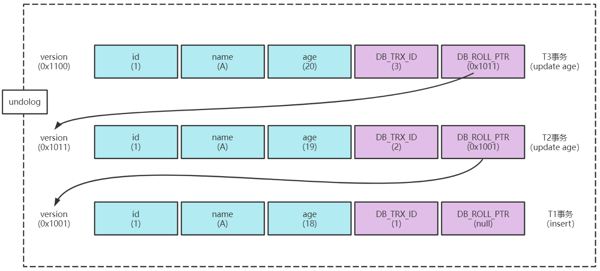

# 数据库中的锁应用

* 锁类型及应用
* MVCC(多版本并发控制)

## 锁的类型

* 从性能维度进行分类(悲观锁,乐观锁-性能教好)
* 从操作类型上进行分类(共享锁,排它锁)
* 从数据锁定粒度上进行分析(全局锁,表锁,行锁,...)

## 全局锁应用

* 如何理解全局锁?

全局锁可以对库中所有表上锁,默认是关闭的,使用前可以手动打开.

* 如何打开全局读锁?
```
flush tables with read lock.
```

* 如何关闭全局锁(解锁)?
```
unlock tables;
```

* 全局锁案例演示

事务A | 事务B
----- | -----
flush tables with read lock|
select * from regions | select * from regions
select * from jobs    | select * from jobs
insert into jobs (region_name) values ('A8');|
Can't execute the query because you have a conflicting read lock | insert into jobs(region_name) values ('A9');
...                                                              | 阻塞;
unlock tables |
....          |阻塞结束开始执行.

## 表锁的应用

* 什么是表锁?

表锁是对整张表进行锁定的一种锁的设计,可以分为表读锁,表写锁.

* 如何对mysql中的表添加读写锁?

1. 添加表读锁(lock table regions read);
2. 添加表写锁(lock table regions write);

* 如何对mysql中的表进行解锁?

```
unlock tables;
```
* 当前线程对表添加了表读锁,当前线程可以执行的操作?
1. 读
2. 不可以写,会出错

* 当前线程对表添加了表读锁,其它线程可以执行的操作?

1. 读
2. 写会阻塞,直到解锁或超时

* 当前线程对表添加了写锁,当前线程可以执行的操作?

1.可以读
2.可以写

* 当前线程对表添加了写锁,其他线程可以执行的操作?

1.不可以读写,会被阻塞.(直到解锁或超时)

## 行锁应用

* 什么是行锁?

行锁是mysql中InnoDB存储引擎的一种针对行记录进行加锁的一种实现方式,默认所有的
select 操作不加锁.

* 如何理解行锁上的共享锁与排它锁.

1. 共享锁(S锁):允许当前事务读取一行,阻止其它事务对相同记录添加排它锁.
2. 排它锁(X锁):允许当前事务更新数据,阻止其它事务获取相同数据集的共享锁,排它锁.

* 查询时如何添加共享锁和排它锁?

1. 共享锁:select * from regions where id=12 lock in share mode
2. 排它锁:select * from regions where id=12 for update

* 如何保证多个并发事务对同一记录进行操作时数据的一致性?

可以对这条记录添加排它锁,但是这样可能会降低系统并发性能.

## MVCC(多版本并发控制)

* MVCC 是什么?

MVCC(Multi Version Concurrent Control)多版本并发控制,它可以通过历史版本
保证读数据的一致性,但是这样方式相对于添加排它锁,并发性能要好.

* 你是否还记得事务的四个特性,底层是如何保证这些特性成功的?

1. 原子性(通过undolog实现-执行回滚)
2. 隔离性(通过锁,MVCC-版本控制)
3. 一致性(通过undolog,redolog,隔离性)
4. 持久性(通过redolog日志实现)

* MVCC的底层逻辑是如何实现的呢?

  MVCC的实现原理主要依赖于记录中的`三个隐藏字段`，`undolog`，`ReadView`来实现的.

* MVCC中的隐藏字段指的是哪些？(了解)

1. DB_TRX_ID：记录创建这条记录或者最后一次修改该记录的事务id
2. DB_ROLL_PTR：回滚指针，指向这条记录的上一个版本,用于配合undolog实现数据的回滚.
3. DB_ROW_ID：隐藏的主键，如果数据表没有主键，那么innodb会自动生成一个row_id，




* 什么是ReadView？

对于Read Committed和Repeatable Read的隔离级别,都要读取已经提交的事务数据,也就
是说如果版本链中的事务没有提交,该版本的记录是不能被读取的,那哪个版本的事务是可以读取
的,此时就引入了ReadView.

事务执行操作时,会生成当前事务的ReadView,保存当前事务之前活跃的所有事务id。

* ReadView中包含什么？


1. m_ids: 截止到当前事务id之前,所有活跃的事务id。
2. min_trx_id: 记录以上活跃事务id中的最小值。
3. max_trx_id: 保存当前事务结束后应分配的下一个id值。
4. creator_trx_id: 保存创建ReadView的当前事务id。

* 事务隔离(RC,RR)特性的实现？

1. 如果db_trx_id与Readview中的creator_trx_id相等，则说明当前事务在访问自己的操作数据，此时可以访问。
2. 如果db_trx_id小于ReadView中的min_trx_id值,表明生成的该版本的事务在当前事务生成readview之前已经提交,所以可以直接读取.
3. 如果被访问版本的db_trx_id大于ReadView中的max_trx_id值,表明该版本的事务在当前事务生成ReadView后才开启的,所以该版本不可以被当前事务访问.
4. 如果访问的版本的db_trx_id属性值在min_trx_id和max_trx_id之间 ,就需要判断一下db_trx_id的值是不是在m_ids列表中,如果在,说明创建 ReadView时,生成的该版本的事务还是活跃的,该版本不可以访问,如果不存在,则说明创建ReadView时,生成该版本的事务已经提交则可以读取.
   
## 总结(Summary)

* 为什么使用锁？(实现事务与事务之间的隔离)
* MySql中的锁式如何分类的？(从粒度上划分，可分为全局锁，表锁，行锁。)
* 如何理解MySQL的全局锁、表锁、行锁？
* 如何理解MySQL中的共享锁、排它锁？
* 如何理解MVCC(多版本并发控制)？
* 为什么使用MVCC呢？(在保证性能的基础上实现事务的隔离性)  
* 如何理解MVCC中的ReadView(一致性快照读视图)？
  


   


