# JVM (JAVA虚拟机)

## 内容安排

* JVM体系结构
* JVM中的类加载子系统
* JVM中运行时内存区
* JVM中执行引擎(执行逻辑，GC逻辑)
* JVM中的字节码增强技术(拓展)

## 思维导图

* JVM 产品

  https://www.processon.com/view/link/6346b8b7f346fb07deb7aedb

* JVM 类加载
  
  https://www.processon.com/view/link/6321bd440e3e743f5833ce29
  
* JVM 运行时内存
  
  https://www.processon.com/view/link/635e48cf1e08530a6081c147

* JVM 执行引擎部分

  https://www.processon.com/view/link/6361028e1e08530a6087f36a

## JVM初识

* 为什么要学习JVM？
```
1. 为了面试 
2. 为了更好的理解JAVA
3. 为了更好的解决线上问题？(软件在线升级、防内存泄漏、提高吞吐量)
```
 
* 你了解哪些JVM产品？

```
1. Oracle公司的HotSpot。
2. IBM公司的J9
3. 阿里的TaobaoVM
4. .....
```

# JVM的体系结构

## JVM是什么？

一种虚拟机规范

## JVM的构成有哪几部分？
```
1. 类加载子系统(负责将类读取到内存,校验类的合法性，对类进行初始化)
2. 运行时数据区(负责存储类信息，对象信息，以及执行计算的区域)
3. 执行引擎(负责从指定地址对应的内存中读取数据然后执行，同时还自带GC操作)
4. 本地库接口(负责Java语言与其它语言之间进行通讯)
```

## Hotspot虚拟机(JVM)的构成？

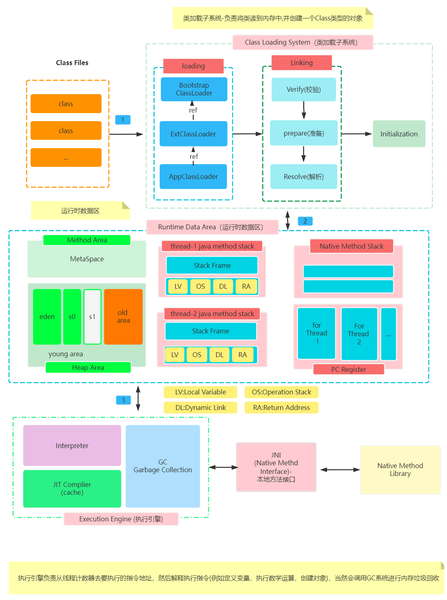


# JVM中类加载子系统

## 类加载子系统中有哪些常用类加载器吗？
```
1. BootStrapClassLoader(负责加载基础类库中的类,例如Object,String,....)
2. ExtClassLoader(负责加载扩展类库中的类ext/...)
3. AppClassLoader(负责加载classpath路径下我们自定义的类)
4. 自定义ClassLoader(可以指定自己要加载的路径或加载方式)
```

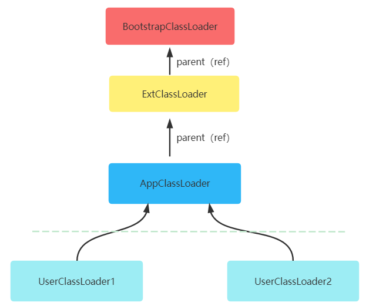


## 什么是双亲委派类加载模型？

```
双亲委派可以简单理解为依次向上询问类是否已经加载过，假如加载过则无需再次加载。
假如没有加载过则从顶层(BootStrapClassLoader)向下依次尝试是否可以加载此类，
假如可以则对类进行加载。
```

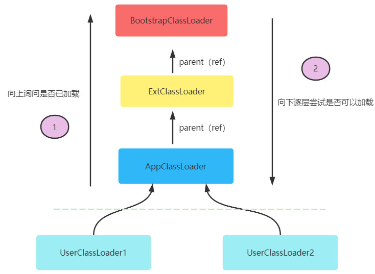

## 为什么要使用双亲委派加载模型？

```
通过这种机制可以更好保证一个类在内存中只被加载一次，例如java.lang.Object这个基础
类库中的类不需要反复加载。
```

## 双亲委派加载模型有什么弊端吗？

```
假如不同项目部署到了同一个web服务中，但是不同项目中有包名、类名相同的类(内容不同)，
这样可能会导致有一个类不会被加载。假如要想解决这个问题可以自己定义类加载规则，但是
无论你怎么定义，建议基础类库还是要使用双亲委派方式进行加载。
```


## 你能说说类加载的基本步骤吗？

```
1. 查找类(例如从指定路径找到包名+类名对应的文件)
2. 读取类(通过字节输入流对类进行读取)
3. 校验类(对内存中读取到的类信息进行校验、默认初始化等)
4. 创建字节码对象(java.lang.Class)
```

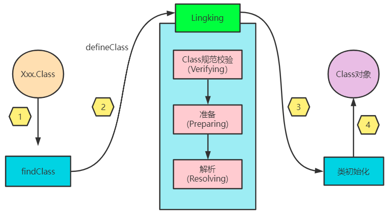

## 什么情况下会触发类的加载？

```
1. 直接通过类加载器(ClassLoader)的loadClass去加载。
2. 基于Class.forName("包名.类名")方式去加载。
3. 直接访问类的属性，方法，构建类的对象。
```

## 类加载时一定会执行静态代码吗？

```
不一定，静态代码块是否执行取决于类加载时是否执行了类的初始化。
```

## 如何理解类的主动加载和被动加载？

```
1. 主动加载：访问本类成员或方法时触发的类的加载。
2. 被动加载：访问本类对应的父类属性、方法时，本类属于被动加载，父类属于主动加载。
```

## 我们可以自己定义类加载器吗？

```
可以，当系统提供的类加载器不满足我们需求时，我们可以通过直接或间接的继承ClassLoader的方式，来定义
自己的类加载器。例如：

class SimpleClassLoader extends ClassLoader{
 ...
}
参考01-java项目中的com.jvm.SimpleClassLoader.
```
## 什么场景下需要自己定义类加载器？

```
1. 指定加载源头？(例如从数据库中读取类)
2. 保证类的安全？(例如可以在类编译时加密，加载时解密)
3. 打破双亲委派模型？(对自己写的类不想使用双亲委派机制了)
```

## 内存中一个类的字节码对象(Class)可以有多个吗?

```
可以，即使是同一个类，但是它的类加载器不同，生成的字节码对象也可以不同。
```

# JVM运行时内存区

## JVM 运行时内存区是如何划分的？

```
1. 方法区(Method Area): 存储类的字节码信息、常量池。
2. 堆区(Heap Area): 存储对象
3. Java方法栈(Stack Area): 所有方法运行时，会创建一个栈帧对象，然后进行入栈
4. 本地方法栈(Stack Area)：用C语言写的,方法执行时候，会进入本地方法栈
5. 程序计数器(Pc Register): 用于记录当前线程要执行的下一条字节码指令的地址
```

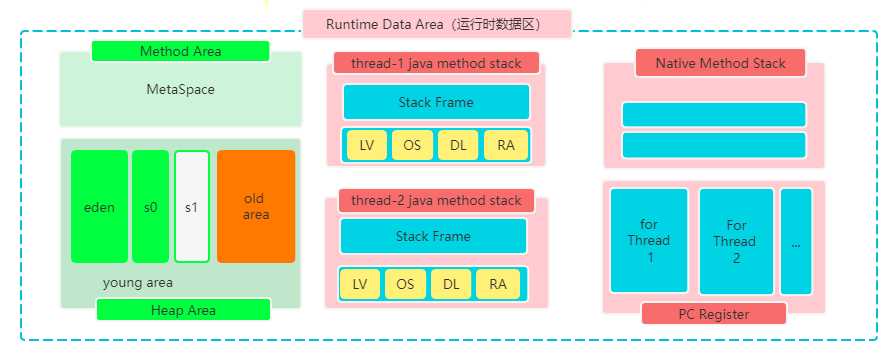


## 如何理解方法区(Method Area)？

```
方法区是逻辑上一种定义，是一种规范，可被所有线程所共享，不同JVM对方法区的落地实现可能不同，例如
在JDK7中方法区称之为持久代，在JDK8中方区叫元空间(Metaspace)，并且这个元空间
可以是JVM堆外的一块内存，不占用操作系统为JVM分配的内存。

```

## 如何理解JAVA中的堆(Heap)，它的构成是怎样的？

```
Java中的堆是用于存储对象的一块区域，可被所有线程所共享。这块区域又可以分为年轻代和老年代，
年轻代又分伊甸园区和2个幸存区(有一块区域始终是空的)。
```

## JVM虚拟机栈的结构是怎样？

Java中每个线程都有一个虚拟机栈(Java方法栈),每个方法的执行都会对应着一次入栈(Push)和出栈(Pop)操作，
栈中的元素为一个一个的栈帧(Stack Frame)对象，这个栈帧的构成主要有如下几部分:

```
1. 操作数栈(用于执行运算)
2. 局部变量表(用于存储方法内部的局部变量)
3. 方法的返回值(存储方法的返回值)
4. 动态链接(方法中要访问的一些常量池数据，要调用的方法，都会对应一个链接)
5. 其它信息
```

## 如何理解程序计数器？

```
程序计数器用于记录当前线程要执行的下一条指令的偏移量地址，每个线程都有一个程序计数器，
这个计数器也是所有内存中唯一一个不会出现内存溢出的区域。
```

## Java对象分配内存的一个基本过程是怎样？

```
1. 编译器通过逃逸分析(JDK8已默认开启)判定对象是在堆上分配还是在栈上分配。
2. 假如确定是在堆上分析，则可首先选择TLAB区，检测这块区域是否可以存储这个对象，可以则存储。
3. 假如TLAB区无法存储新创建的对象，则可以考虑在TLAB之外的Eden区加锁分配。
4. 如果Eden区无法存储对象，则执行Yong GC (Minor)-年轻代的垃圾回收
5. 假如Eden区执行Yong GC之后，仍然不足以存储对象，则直接分配老年代。
6. 假如老年代也不可以存储这个对象，则执行Full Gc，这个过后还不能存储则抛出异常。

```
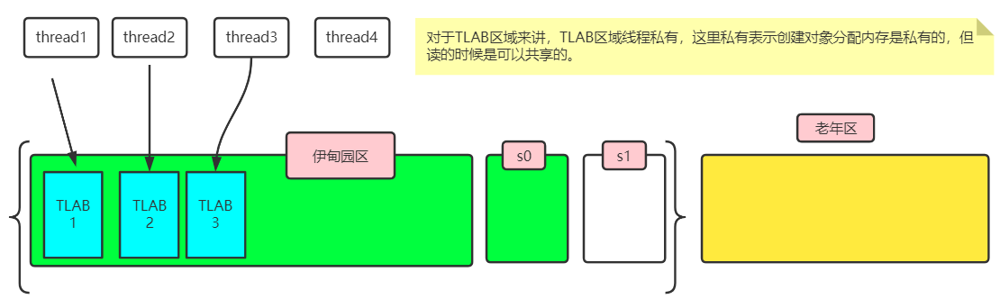


## JVM中年轻代中幸存区设置的比例比较小，可能会产生什么问题？

```
年轻代的伊甸园区对象越来越多时，会启动Yong GC，此时伊甸园区的对象就要拷贝到幸存区。
假如这个幸存区比较小，无法存储从伊甸园区拷贝过来的幸存对象，此时这些对象就可能直接
分配到老年代，就会导致老年代对象越来越多，触发老年代GC的频率就变高，老年代的GC一般
为FullGC，这个GC的时间会比较长，会影响系统的吞吐量和执行效率。

说明：伊甸园区与两个幸存区的比例通常是8:1:1
```

## 假如伊甸园区设置的比例比较小，可能会有什么问题？

```
我们创建的对象，大部分是要存储在伊甸园区。假如伊甸园区比较小，可能会增加GC的频率。
进而影响系统的执行性能。
```

## JVM的堆内存为什么要分为年轻代和老年代？

```
通过分代设计，减少GC的空间范围，提高GC效率。
```

## JVM调优中为什么推荐初始堆大小和最大堆大小要设置为一样的？

```
避免程序在运行过程中，因对象的多少或GC后内存的变化，进而导致的内存大小的调整，
这个内存大小调整的过程可能会带来更大的系统开销。(阿里的开发规范中也是推荐设置为一样)
```

## 什么情况下对象可能会直接存储到老年代？

```
1. 创建的对象比较大，年轻代没有空间存储这个对象。
2. 经过多次GC，没有被回收的对象，随着年龄的增加可能会移动到老年代。
```

## Java中所有的对象都是分配在堆上的，对吗？

```
随着技术的进步，这个说法已经不是那么准确了，对象可以分配在栈上了(小对象、
未逃逸可以分配在栈上)。
```

## Java中的逃逸分析如何理解，可以解决什么问题？

```
逃逸分析本质上是一种数据分析算法，基于这个算法判定对象是否发生了逃逸，未逃逸的对象可以
直接分配在栈上、也可以执行标量替换。这样可以有效减少对象在堆上的分配，进而减少阻塞、GC
频率，提高执行效率。

案例：01-java/com.jvm.EscapeAnalysisTests
```

## 如何理解Java中的标量替换技术，为什么要进行标量替换？

```
标量替换是一种将对象打散(将对象中成员以局部变量方式进行设计)分配在栈上的技术，
减少对象在堆中创建次数，进而降低GC频率，提高其性能。

案例参考：01-java/src/com.jvm.EliminateAllocationsTests
```

## 什么是内存溢出以及导致内存溢出的原因？

```
内存中剩余的内存空间不足以分配给新的内存请求，此时就会出现内存溢出。内存溢出可能会导致
系统崩溃，具体可能导致内存溢出的原因有:

1. 创建的对象太大。
2. 创建的对象太多了，又有大量的内存泄漏。
3. 方法区的类太多了，没有足够的空间存储一些新的类型了。
4. 方法出现了无限递归调用，可能会导致栈内存溢出。

```

## 什么是内存泄漏以及导致内存泄漏的原因？

```
程序中的对象在使用完毕后，对象占有的内存空间，没有得到及时的释放，一直占用着内存空间，
这个现象就称之为内存泄漏。常见内存泄漏可能有：

1. 缓存使用不当(例如缓存中对对象的引用都是强引用)
2. 内部类的使用不当(例如实例内部类会默认保存外部类引用)
3. 大量的IO，链接操作没有得到及时关闭。
4. 大量的使用static变量(这样的变量的生命周期不依赖于变量所在类对象)
5. .....
```

## JAVA中的四大引用有什么特点？

```
Java中为了更好的控制对象的生命周期，提高对象对内存的敏感度，设计了四种引用类型，按其在内存
中的生命力强弱，可分为强引用、软引用、弱引用、虚引用。其中，强引用引用的对象生命力最强，其它
引用引用的对象生命力依次递减。JVM的GC系统被触发时，会因为对象的引用不同，执行不同的回收逻辑。

案例参考：01-java/src/com.jvm.ReferenceTests
```

# JVM中的GC系统

## 什么是GC?

GC(Garbage Collection)称之为垃圾回收，在JVM的执行引擎中自带这样的一个GC系统，
此系统会按照一定的算法对内存进行监控和垃圾回收。

## GC时要考虑哪些问题？

1. 如何判断哪些对象是可回收对象
2. 使用什么算法对这些对象进行回收
3. 执行GC时的线程策略是什么?

## 如何判定哪些对象是垃圾？

1. 引用计数法(每个对象都一个引用计数器，只要有引用引用着这个对象，这个计数器就会加1，没有引用引用计数器的值就是0)
2. 可达性分析(从一些GC Root对象可以无法找到这个对象，此对象就是垃圾)

思考：引用计数法有什么缺陷？(循环引用)

## 哪些对象可以作为GC Toot对象

1. 类变量、常量直接引用的对象
2. 实例变量直接引用的对象
3. 局部变量、参数变量直接引用的对象
4. ...   

## 你知道哪些常用的GC算法？

1. 标记清除(扫描内存，对活着的对象进行标记，再次扫描内存，对未标记对象进行清除。)
   
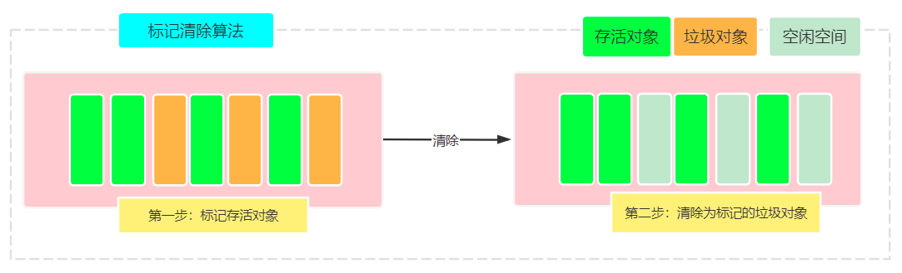

2. 标记复制(扫描内存，将活着对象标记同时拷贝到一块空闲区，然后将原有内存全部清空)
 
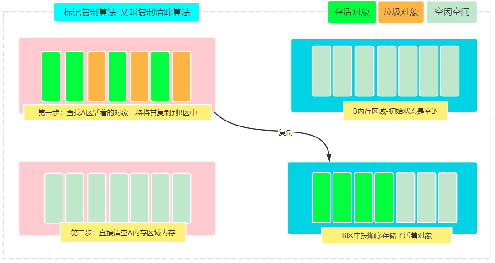  

3. 标记整理(扫描内存，将活着对象向一侧移动，然后将边界外的内存进行清空)

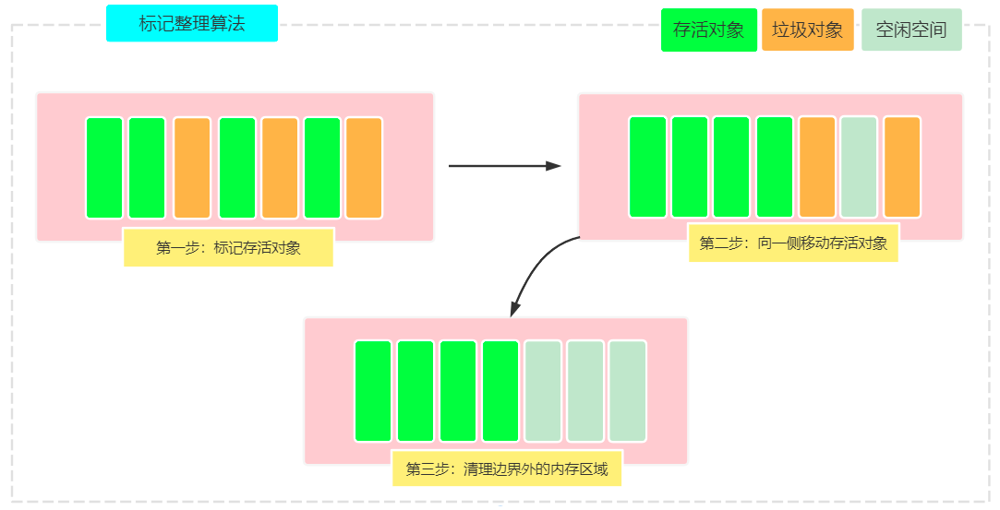

## JVM执行GC时的线程策略？

1. 串行(整个GC过程只有1个线程执行)
2. 并行(允许多线程利用多核CPU优势执行并行GC)
3. 并发(允许GC线程和业务线程并发执行)

## JVM中的有哪些常用的垃圾回收器？

1. Serial (串行垃圾回收器)
2. Parallel (并行垃圾回收器- Parallel New)
3. CMS (并发垃圾回收)
4. G1 (基于大内存的并发垃圾回收)
5. ......

## 如何查看JVM默认的垃圾回收器？

-XX:+PrintCommandLineFlags

## Serial收集器的特点？

1. 内部只使用一个线程进行垃圾回收，不能执行并行化(不能充分利用多核CPU优势)
2. GC时所有正在执行的业务的线程都要暂停(Stop The World - STW)
3. 新生代使用标记复制算法，老年代使用标记整理算法。

> 应用：-XX:+UseSerialGC

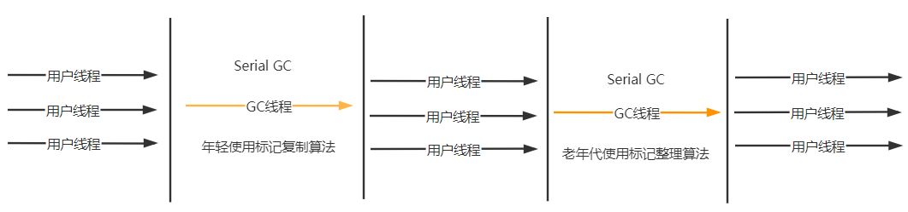

## Parallel收集器的特点？

1. 内部有多个线程进行垃圾回收，可以利用多核CPU优势进行并行GC操作，可以减少业务暂停时间。
2. GC时所有正在执行的业务线程都要暂停(Stop The World - STW)
3. 新生代使用标记复制算法，老年代使用标记整理算法。

> 应用：-XX:+UseParallelGC

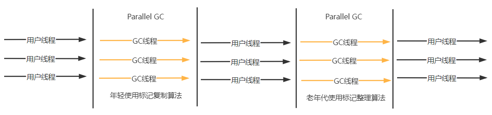

## CMS(Concurrent Mark and Sweep)收集器特点？

1. 内部有多个线程进行垃圾回收，可以利用多核CPU优势并行GC操作，可以减少业务暂停时间。
2. 用户业务线程和GC线程可以并发执行。
3. 新生代使用标记复制算法，老年代使用标记清除算法(不整理内存，响应速度会更快)。

> 应用：-XX:+UseConcMarkSweepGC

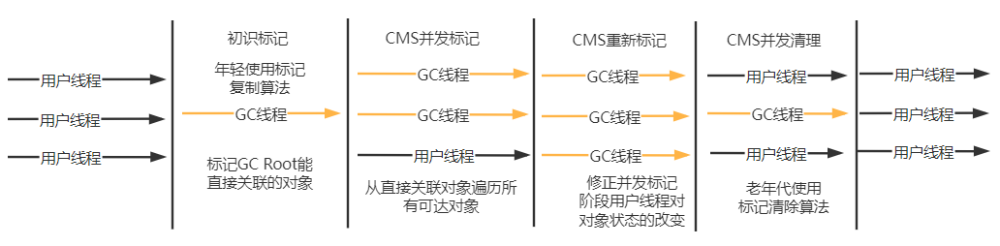

## G1(Garbage-First)收集器

1. 工作于服务器模式，主要面向多核、大内存的服务器应用。
2. 整个堆不再分成连续的年轻代和老年代，而是划分为了多个小堆区。
3. GC时不会每次收集整个堆，而是以增量方法进行GC操作，每次只是对一个小堆区进行GC。
4. 可以在吞吐量和响应时间上达到一种相对的平衡。
5. 年轻代使用标记复制算法，老年代使用标记整理算法。

> 应用：-XX:+UseG1GC

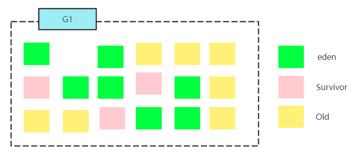

## JVM如何调优？

```
1. 为什么调优? (降低系统宕机风险、提高程序执行效率)
2. 调优的目标？(减少GC次数，避免大GC、提高吞吐量和响应速度，改善用户体验)
3. 调优的方案？(确定问题;更换CPU,内存; 调内存大小、比例参数、调整GC收集器)
```

# JVM常用参数分析

## 检查类加载

```
-XX:+TraceClassLoading
```

## 方法区参数配置

```
1. -XX:MetaspaceSize
2. -XX:MaxMetaspaceSize
```

## 常用堆参数配置

```
1. -Xms2048m(设置初始堆大小为2048m)
2. -Xmx2048m(设置最大堆大小为2048m)
3. -Xmn1g(设置年轻代大小为1g)
4. -XX:NewRatio=4(设置年轻代与老年的比例大小)
5. -XX:SurvivorRatio=4(设置年轻代中的Eden区与Survivor区比值，这里的4表示4:1:1)
6. -XX:MaxTenuringThreshold=15(年轻代对象转换为老年代对象最大年龄值，默认值15)
7. ....
```

## 常用栈参数配置

```
1. -Xss128k(设置每个线程的栈大小)
```

## GC日志参数配置

```
1. -XX:+PrintGC (GC简单日志)
2. -XX:+PrintGCDetail (GC详细日志)
```

## 垃圾回收器参数配置

1. Serial垃圾收集器（新生代）
```
开启：-XX:+UseSerialGC
关闭：-XX:-UseSerialGC
```

2. Parallel垃圾收集器（老年代）
```
开启 -XX:+UseParallelGC
关闭 -XX:-UseParallelGC
```

3. CMS垃圾收集器（老年代）
```
开启 -XX:+UseConcMarkSweepGC
关闭 -XX:-UseConcMarkSweepGC
```

4. G1垃圾收集器
```
开启 -XX:+UseG1GC
关闭 -XX:-UseG1GC
```

#总结(Summary)

## 重难点
* JVM的构成？(四大部分)
* JVM的类加载器以及类加载机制？
* JVM的运行时内存(线程私有区、线程共享区)
* JVM中的执行引擎(JIT即时编译、GC系统-垃圾对象、GC算法、线程策略、垃圾回收器)
* 课后拓展(JAVA 字节码增强技术)

## FAQ分析
* ........


